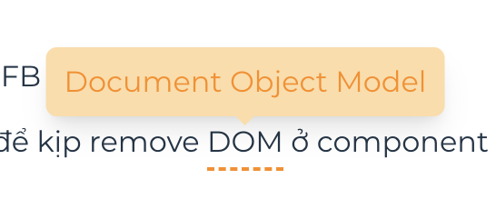

# `rspress-plugin-abbr-tooltip` 

And it will be rendered as:

<div align="center">
  
</div>

## Usage

```bash
npm i rspress-plugin-abbr-tooltip
pnpm add rspress-plugin-abbr-tooltip
```

```ts
import * as path from "path";
import { defineConfig } from "rspress/config";
import { pluginAbbreviate } from "rspress-plugin-abbr-tooltip";

export default defineConfig({
  root: path.join(__dirname, "docs"),
  plugins: [
    pluginAbbreviate({
      DOM: "Document Object Model",
    }),
  ],
});
```
